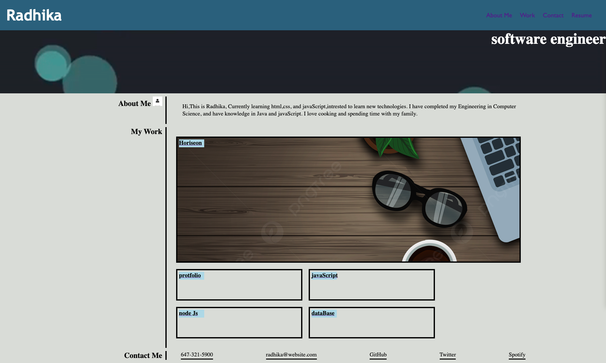

# employePortfolio

Portfolio Project: 
A portfolio of work can showcase your skills and talents to employers looking to fill a part-time or full-time position. 
An effective portfolio highlights your strongest work as well as the thought processes behind it. 

In this Challenge gives future success by applying the core skills we've recently learned: flexbox, CSS Grid Layout, and CSS variables. Y

Technologies used: 
HTML CSS

ScreenShot of the application:

Link to deployed application:
